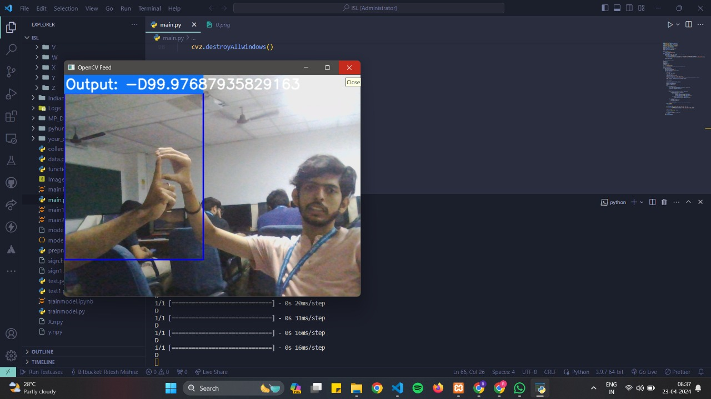

# Indian-Sign-Language-Machine-Learning-Group-Project

Indian Sign Language is a Machine Learning Project developed by:-

Safal Mehrotra (RA2111027010006),
Gaurang Ashava (RA2111027010007),
Syed Adnan Hussainy (RA2111027010008),
Rahul Nair (RA2111027010009)

 

The dataset used in this project is supported by Kaggle 
The link for the dataset is given below - <href> https://www.kaggle.com/datasets/vaishnaviasonawane/indian-sign-language-dataset </href>

The landing page in the project is been made using HTML CSS and basic fundamentals of JS.

In this model, live feed will be captured dynamically within micro-seconds and the output will be given in the .png format which will combine together and form a video.
 
 
This is the landing page of our model 
 

 
This is the output from the model file 
 

 

 
